# Mini GPT — Visual Exam Guide

A small GPT built from scratch in **C**, made **concurrent** with CUDA and
**distributed** with MPI. Every section is one picture plus a few lines.


## Contents

1. [The whole system (pipeline)](#1-the-whole-system)
2. [Three builds from one codebase](#2-three-builds-from-one-codebase)
3. [The model at a glance](#3-the-model-at-a-glance)
4. [Forward pass — the full model](#4-forward-pass--the-full-model)
5. [Inside one transformer block](#5-inside-one-transformer-block)
6. [Self-attention](#6-self-attention)
7. [BPE tokenizer](#7-bpe-tokenizer)
8. [DataLoader](#8-dataloader)
9. [The training loop](#9-the-training-loop)
10. [Backward pass](#10-backward-pass)
11. [AdamW optimizer](#11-adamw-optimizer)
12. [CONCURRENT — CUDA on the GPU](#12-concurrent--cuda-on-the-gpu)
13. [DISTRIBUTED — MPI across processes](#13-distributed--mpi-across-processes)
14. [Text generation](#14-text-generation)
15. [Cheat sheet](#15-cheat-sheet)

---

## 1. The whole system

Each tool transforms the data one step further: a PDF becomes clean text,
text becomes a tokenizer + a stream of token numbers, numbers train weights,
and weights generate new text.

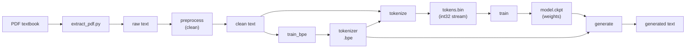

| Stage | In | Out |
|-------|----|----|
| extract / preprocess | PDF | clean Serbian text |
| train_bpe | clean text | tokenizer (merge rules) |
| tokenize | text + tokenizer | `tokens.bin` |
| train | tokens | `model.ckpt` |
| generate | checkpoint + prompt | new text |

---

## 2. Three builds from one codebase

The *same* C source compiles three ways, chosen by compile-time flags. The
flags compose: you can turn on CUDA, MPI, or both. Everything GPU/MPI-specific
is hidden behind `#ifdef USE_CUDA` / `#ifdef USE_MPI`, so the plain Mac build
is untouched.

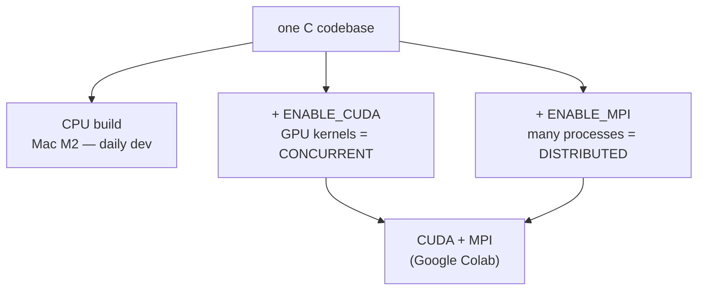

| Build | Where | What it adds |
|-------|-------|--------------|
| `ENABLE_CUDA=OFF MPI=OFF` | Mac M2 | nothing — pure CPU, the reference |
| `ENABLE_CUDA=ON` | Colab T4 | GPU kernels (the **concurrent** part) |
| `ENABLE_MPI=ON` | Colab | multi-process gradient averaging (the **distributed** part) |

---

## 3. The model at a glance

A tiny GPT-2-style transformer. Every dimension below is derived from these
six numbers, and **all ~534K weights live in one contiguous array** — which is
what lets the optimizer update them in one loop and MPI average them in one
call.

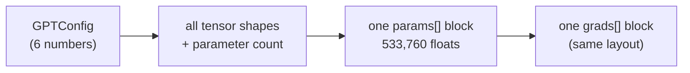

| Hyperparameter | Symbol | Value |
|----------------|--------|-------|
| Layers | L | 2 |
| Embedding dim | C | 128 |
| Attention heads | NH | 4 (head_dim = 32) |
| Feed-forward dim | FF | 512 (= 4·C) |
| Context length | T | 64 |
| Vocab size | V | 512 |
 
**Where the 533,760 parameters live** (the 13 weight tensors):

| Tensor | Shape | Count |
|--------|-------|-------|
| token embedding `wte` | V·C | 65,536 |
| position embedding `wpe` | T·C | 8,192 |
| 2 × transformer block | — | 394,240 |
| final layernorm | 2·C | 256 |
| output head `lm_head_w` | C·V | 65,536 |
| **Total** | | **533,760** |

---

## 4. Forward pass — the full model

Tokens go in, a single loss number comes out. The middle is `n_layer`
identical transformer blocks stacked on a **residual stream** `x` — a "highway"
of numbers that each block *adds a correction to* rather than replacing.

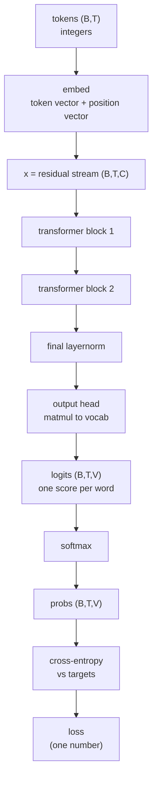

> **loss** answers one question: *"how surprised was the model by the real next
> token?"* It is always ≥ 0 because it is `-log(probability)`.

---

## 5. Inside one transformer block

Every block does two jobs in order: **attention** mixes information *across*
tokens (horizontal), then the **feed-forward network (FFN)** thinks about each
token on its own (vertical). Each job ends with a residual add (`x = x + ...`).

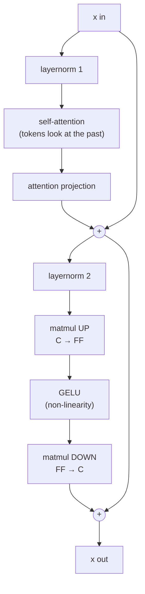

- **Residual add `+`** lets gradients flow straight back, so deep networks
  train. Each block computes a small edit, not a rewrite.
- **GELU sits *between* the two matmuls** — without a non-linearity in the
  middle, two matmuls collapse into one and the FFN learns nothing.
- **Layernorm goes *before* each block** (pre-norm): the skip path stays a
  clean identity while each block still gets well-scaled inputs.

> Memory hook: **attention = mixing between tokens · FFN = thinking per token.**

---

## 6. Self-attention

One matmul produces Query, Key, Value for every token. Each token scores how
much it cares about every *earlier* token, softmaxes those scores into weights,
and takes a weighted average of their Values.

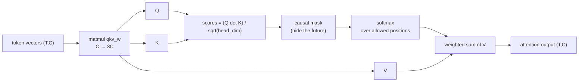

**Causal mask** — a token may look at itself and the past, never the future
(that would be cheating at next-token prediction). `✓` = allowed, blank = masked:

|        | key t0 | key t1 | key t2 | key t3 |
|--------|:------:|:------:|:------:|:------:|
| **query t0** | ✓ |  |  |  |
| **query t1** | ✓ | ✓ |  |  |
| **query t2** | ✓ | ✓ | ✓ |  |
| **query t3** | ✓ | ✓ | ✓ | ✓ |

**Multi-head** — split the `C` columns into `NH` groups, run attention in each
group independently, then glue them back. Different heads learn to track
different relationships (like reading with several highlighters at once).

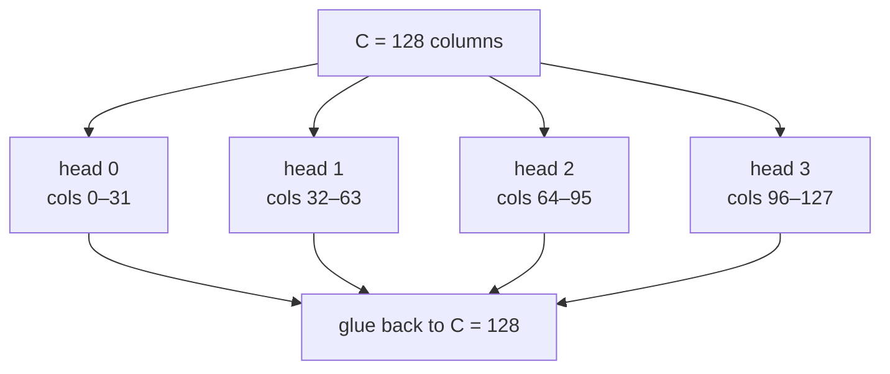

> **Why divide by sqrt(head_dim)?** A score is a sum of `head_dim` products, so
> it grows with width. Large scores make softmax nearly hard ("pick one") and
> its gradient vanishes. Dividing keeps softmax soft and trainable.

---

## 7. BPE tokenizer

Byte-Pair Encoding learns a vocabulary by repeatedly merging the **most
frequent adjacent pair** into a new token. Common substrings (then words)
emerge on their own. Start = 256 byte tokens; each merge adds one token id.

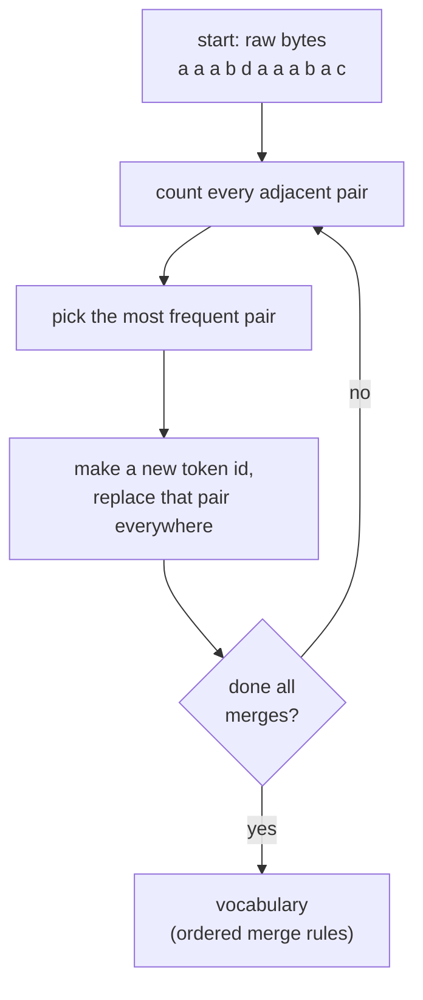

Training `aaabdaaabac` for 3 merges (`a`=97 … `d`=100):

| Step | Most frequent pair | New token | Means |
|------|--------------------|-----------|-------|
| 1 | (97, 97) = `aa` | 256 | `aa` |
| 2 | (256, 97) | 257 | `aaa` |
| 3 | (257, 98) | 258 | `aaab` |

**Encoding** re-applies those rules in order, so `aaabd` (5 bytes) becomes just
`[258, 100]` (2 tokens) — that compression is the whole point.

> Each merge can reuse earlier merges (merge 2 uses token 256). The merge's
> index *is* its token id: index `i` → id `256 + i`.

---

## 8. DataLoader

The "teacher": it slides a window over the token stream and hands the model
practice questions. `targets` is simply `inputs` shifted right by one — that
shift *is* the next-token prediction task.

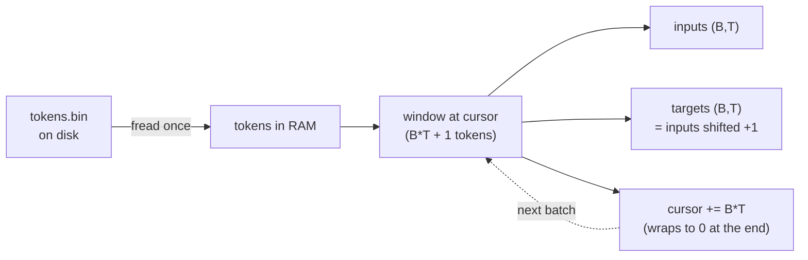

One batch with `B=2, T=4` over a sequential file:

| | inputs | | targets (shifted +1) |
|-|--------|-|----------------------|
| row 0 | `0 1 2 3` | → | `1 2 3 4` |
| row 1 | `4 5 6 7` | → | `5 6 7 8` |

> A batch needs `B*T + 1` tokens (the `+1` is the last row's final target). The
> cursor advances by `B*T` so that extra token is reused as the next batch's
> first input — the stream stays continuous, and **wraps to 0** at the end so
> the file feels infinite (epochs).

---

## 9. The training loop

One step is the entire project in miniature. Repeat until the printed loss
trends down — that downward trend is the **"acid test"** that the whole
forward / backward / update pipeline is correct.

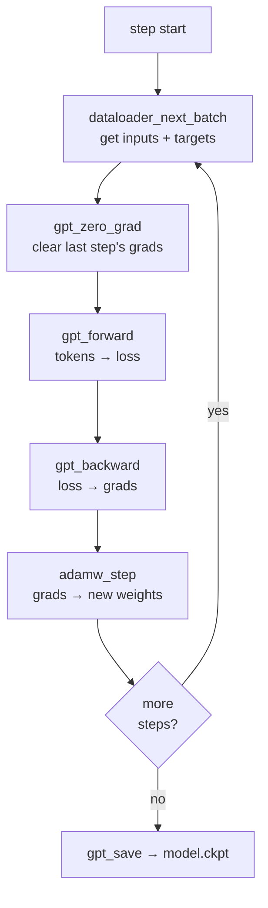

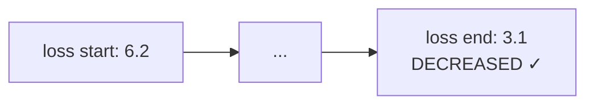

> `gpt_zero_grad` matters because backward **accumulates** gradients with `+=`
> (the residual stream is read twice per layer, so its gradient is a sum of two
> paths). Without zeroing first, this step would pile onto the last step's
> leftovers.

---

## 10. Backward pass

Backward walks the forward diagram **in reverse**, turning "how wrong was the
loss" into "which way should each weight move." Each `_backward` op accumulates
into `grads` with `+=`.

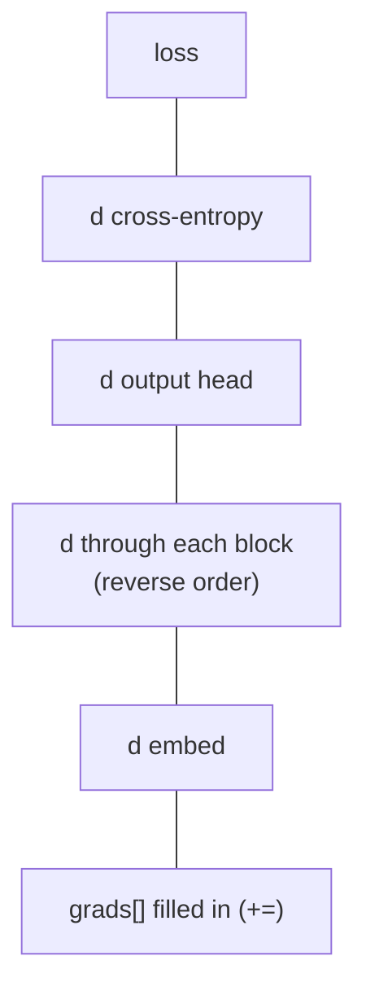

**How we *know* the gradients are right** — the gold-standard test. Nudge one
weight by a tiny `h`, re-run forward twice, and compare the slope to the
analytical gradient:

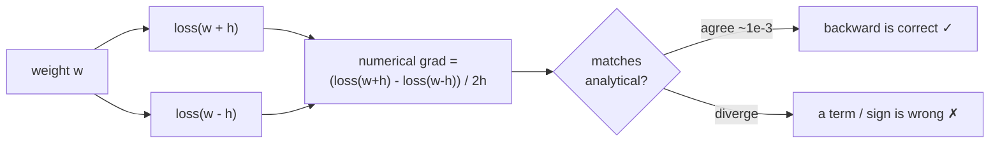

> If any single layer's backward has a missing term, a sign flip, or a
> forgotten `1/sqrt(head_dim)`, the two gradient vectors diverge and the test
> fails. This is checked on the *whole* model at once.

---

## 11. AdamW optimizer

Plain gradient descent uses one fixed step size for every weight — clumsy.
Adam gives **each weight its own step size** using two running averages, then
AdamW adds a gentle pull toward zero (weight decay).

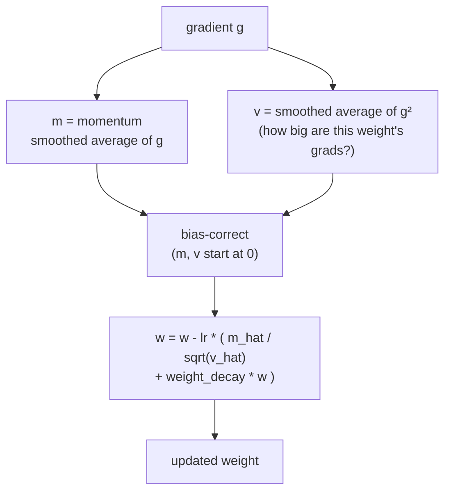

- **Step in direction `m`, scaled by `1/sqrt(v)`** → steep directions take
  careful steps, flat directions get boosted.
- **Bias correction** fixes the cold start (`m`, `v` begin at 0); it fades to 1.
- **The "W"** = weight decay applied *straight to the weight*, kept separate
  from the gradient. That separation is the only difference from plain Adam.

| Knob | Typical | Role |
|------|---------|------|
| `lr` | 1e-3 | base step size (most important) |
| `beta1` | 0.9 | momentum smoothing |
| `beta2` | 0.999 | squared-grad smoothing |
| `eps` | 1e-8 | divide-by-zero guard |
| `weight_decay` | 0.01 | pull-toward-zero strength |

> The optimizer never knows what a "GPT" is — it just sees two equal-length
> float arrays, `params` and `grads`, and updates one loop over both.

---

## 12. CONCURRENT — CUDA on the GPU

A CPU has a few fast cores; a GPU has **thousands of slow ones**. It wins when
the same simple operation runs over a huge pile of data. Threads are organized
into a **grid of blocks**, and threads in a block share a tiny, ~100× faster
**shared memory** scratchpad.

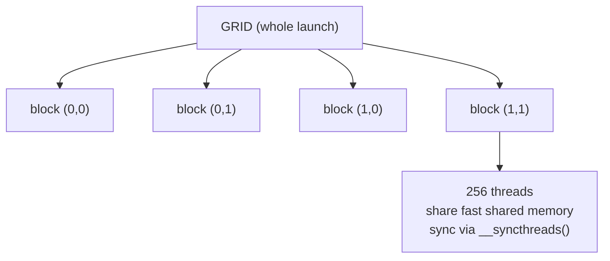

**Tiled matmul** — the headline optimization. Instead of re-reading rows/cols
from slow memory for every output cell, a block loads 16×16 tiles into shared
memory **once** and reuses them.

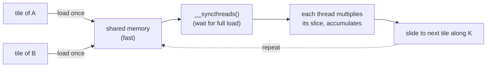

**Reduction** (used by layernorm & softmax) — combining `C` numbers into one
(a mean/sum) is done as a **tree**: halve the active threads each step, so it
takes `log2(C)` steps instead of `C`.

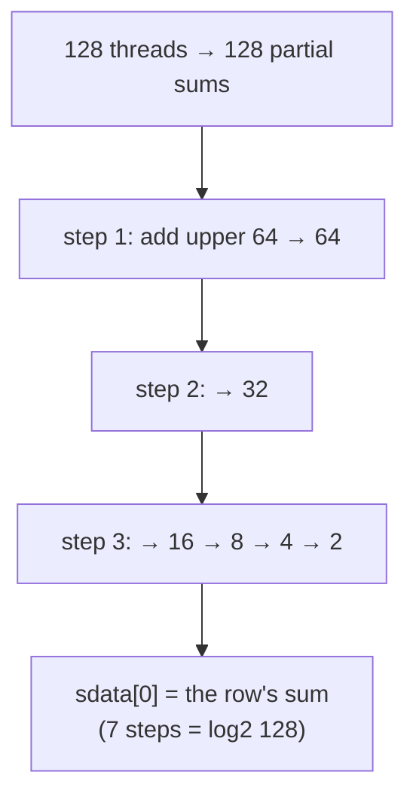

**How we know the GPU is right:** the proven CPU function is the **oracle** —
run both on the same input, compare every element within `~1e-4` tolerance
(not bit-identical, because the GPU sums in a different order).

| Kernel | Parallelized over | Shared mem? |
|--------|-------------------|:-----------:|
| matmul | output tiles (16×16) | yes (tiling) |
| layernorm | one block per row | yes (reduction) |
| softmax | one block per row | yes (reduction) |
| attention | per (batch, head, query) | no |
| gelu / residual / embedding | per element | no |

---

## 13. DISTRIBUTED — MPI across processes

**Data parallelism**: launch `N` copies of the program (`mpirun -np N`). Each
copy is a **rank** with a full model. They give each rank a *different* batch,
then average the gradients so every rank applies the *identical* update and the
model copies never drift apart.

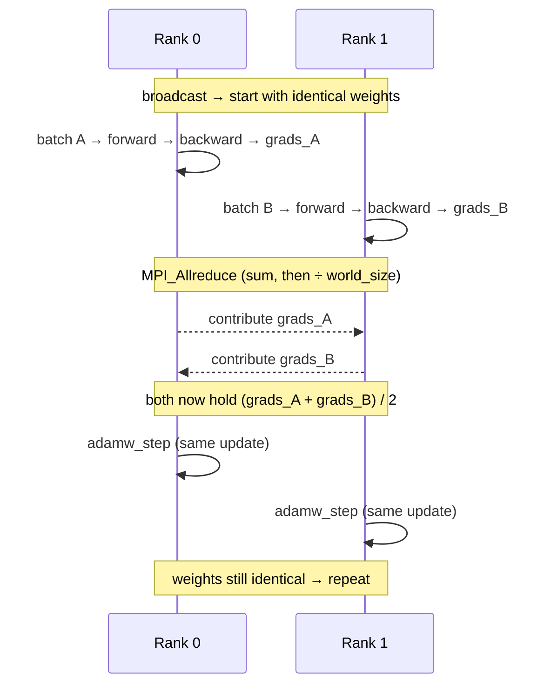

This works because of the **single-block trick**: every gradient is in one
contiguous array, so averaging the whole model is one call:
`mpi_allreduce_mean(model->grads, model->num_params)`.

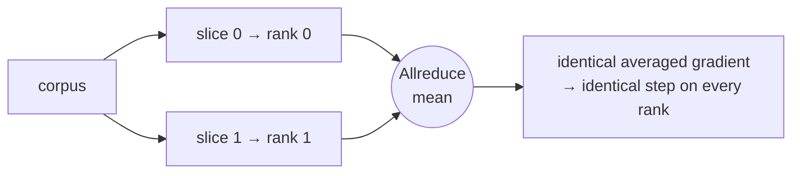

| Function | Wraps | Job |
|----------|-------|-----|
| `mpi_setup` | `MPI_Init` | start MPI, report rank + world_size |
| `mpi_broadcast` | `MPI_Bcast` | copy rank 0's weights to everyone |
| `mpi_allreduce_mean` | `MPI_Allreduce(SUM)` + divide | average grads across ranks |
| `mpi_teardown` | `MPI_Finalize` | shut MPI down cleanly |

> Averaging (not summing) keeps the gradient magnitude — and the learning rate
> you'd use — unchanged as you add ranks. The math equals training on all the
> ranks' batches concatenated into one big batch.

---

## 14. Text generation

A GPT predicts *the next token given all previous ones*. To make text, it
predicts one token, appends it, and predicts again — **autoregressive** looping.

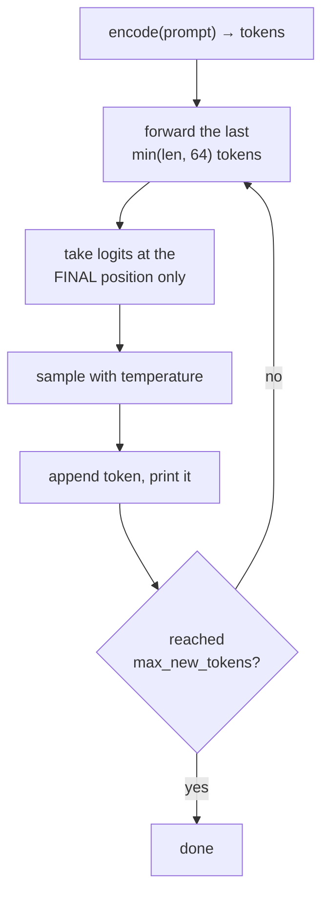

**Temperature** is the randomness knob — it rescales logits before softmax:
`p(token) ∝ exp(logit / temperature)`.

| Temperature | Effect |
|-------------|--------|
| `0` | greedy — always the top token (deterministic, repetitive) |
| `< 1` | sharper — confident choices dominate |
| `1` | the model's raw distribution |
| `> 1` | flatter — rarer tokens get a chance (more random, more garbled) |

> Only the **parameters** are saved in `model.ckpt` (activations/grads are
> scratch the forward pass rebuilds). Expect Serbian-*looking* fragments, not
> coherent sentences — 534K params on a few hundred KB is tiny. Generation is
> the proof that the whole hand-built stack composes end to end.

---

## 15. Cheat sheet

**Symbols** (these letters appear in every shape annotation):

| Symbol | Means | This model |
|:------:|-------|:----------:|
| B | batch size (sequences per step) | 4 |
| T | sequence length (tokens) | 64 |
| C | embedding width (residual stream) | 128 |
| V | vocab size | 512 |
| NH | attention heads | 4 |
| L | transformer layers | 2 |
| FF | feed-forward hidden width | 512 |

**Concurrent vs Distributed** (the two halves of the course):

```mermaid
flowchart LR
    course["seminar"] --> conc["CONCURRENT = CUDA<br/>many threads, one GPU<br/>speed up one step"]
    course --> dist["DISTRIBUTED = MPI<br/>many processes<br/>bigger effective batch"]
```

**How each part proves it's correct:**

| Component | Correctness test |
|-----------|------------------|
| layer forward/backward | numerical gradient check (finite difference) |
| whole GPT backward | one numerical gradient check on the full model |
| CUDA kernels | compare to CPU oracle within `~1e-4` |
| MPI | `mpirun -np 2`: ranks stay identical after a step |
| training (acid test) | loss decreases over steps |
| generation | runs end to end, emits Serbian-looking text |

**One-line mantras:**

- Residual stream = a highway; each block adds a correction, never rewrites.
- Attention mixes *between* tokens; FFN thinks *per* token.
- One contiguous `params` block → optimizer = one loop, MPI = one Allreduce.
- CUDA = load slow memory once into fast shared memory, then reuse.
- MPI data-parallel = different batches, *averaged* gradients, identical step.
- Loss going down = the whole thing works.
</content>
</invoke>
